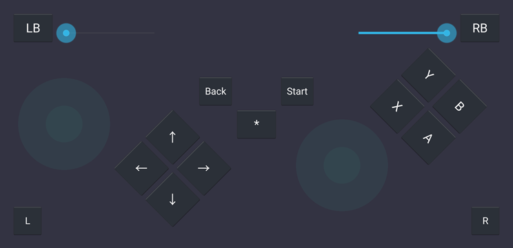

# VirtualJoypad


> [en](README.md) | 中文

- [特点](#特点)
- [快速开始](#快速开始)
- [常见问题](#常见问题)
- [从源码构建](#从源码构建)
- [贡献](#贡献)
- [许可证](#许可证)

------

*VirtualJoypad*是一系列软件让你可以用手机模拟手柄游玩电脑游戏。

这个仓库包含*VirtualJoypad*的源码，用于接受用户输入并与*VirtualJoypadServer*通信。

> VirtualJoypadServer: [https://github.com/Knight-of-night/VirtualJoypadServer](https://github.com/Knight-of-night/VirtualJoypadServer)




## 特点

*VirtualJoypad*使用[ViGEmBus](https://github.com/ViGEm/ViGEmBus)模拟手柄，通过TCP和安卓软件[VirtualJoypad](https://github.com/Knight-of-night/VirtualJoypad)通信。

支持所有手柄事件，包括震动、推杆等。（注意震动在手机上不能精确表现，因为手机只有一个震动马达并且不能调节震动强度。）

XBox和PS4手柄都可以支持，但是目前我只做了XBox。

支持多个手柄连接。

系统要求：Windows和Android。

## 快速开始

### 安装

1. 安装[ViGEmBus驱动](https://github.com/ViGEm/ViGEmBus/releases). [更多信息](https://github.com/ViGEm/ViGEmBus).

2. 下载[ViGEmClient和VirtualJoypadServer](https://github.com/Knight-of-night/VirtualJoypadServer/releases). 把ViGEmClient.dll和VirtualJoypadServer.exe放在同一个文件夹里。

3. 下载并安装[安卓软件VirtualJoypad](https://github.com/Knight-of-night/VirtualJoypad/releases).

### 使用方法

1. 确保你的电脑和手机在相同网络条件下（例如同一个Wifi或者电脑连接手机热点）。如果开着防火墙，需要编辑规则允许本软件通过30001端口。

2. 在电脑上运行VirtualJoypadServer.exe，将会显示一个命令行窗口等待连接。

3. 在手机上运行VirtualJoypad。输入电脑的ip地址，例如`192.168.1.2`（你可以在windows的命令行运行`ipconfig`找到它）。设定灵敏度，这个灵敏度的意思是软件发送左右摇杆信息的速度（其它按键不受这个设置的影响），一般来说默认的数值就够了。

4. 然后点击*connect*按钮，将会进入手柄界面。如果没有问题，电脑上的VirtualJoypadServer会显示新的连接。

5. 恭喜！现在你可以用VirtualJoypad进行游玩了。

## 常见问题

1. **我按下`connect`按钮后*VirtualJoypadServer*没有显示新的连接。**

    请检查你的防火墙。注意有些杀毒软件也有防火墙。

2. **我按住一个按钮/摇杆，有些其它按钮/摇杆点了没反应。**

    因为安卓布局的次序，一个控件在处理输入的时候排在它后面的控件就收不到输入。  
    解决方案可能需要写一些自定义输入处理，太复杂没空做。

## 从源码构建

### 先决条件

* Eclipse，安装 Android Development Tool
* Android SDK

### 获取源代码

```sh
git clone https://github.com/Knight-of-night/VirtualJoypad.git
```

### 编译

1. 用Eclipse打开。
2. 构建。

## 贡献

1. Fork the Project
2. Create your Branch (`git checkout -b <branch_name>`)
3. Commit your Changes (`git commit -m '<commit_message>'`)
4. Push to the Branch (`git push origin <project_name>/<location>`)
5. Open a Pull Request

## 许可证

MIT License.

### 第三方

The app icon is from [Remix Icon](https://github.com/Remix-Design/RemixIcon) under Apache License Version 2.0 .
