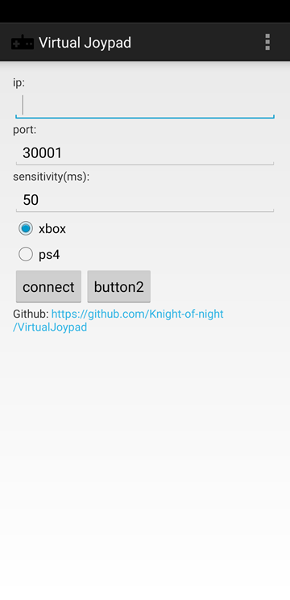
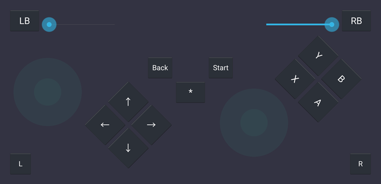

# VirtualJoypad


> en | [中文](README-CN.md)

- [Features](#features)
- [Quick Start](#quick-start)
- [FAQ](#faq)
- [Building From Source](#building-from-source)
- [Contributing](#contributing)
- [License](#license)

------

*VirtualJoypad* is a series of softwares that emulates joypads with mobile phones to play pc games.

This repository contains the source code of the *VirtualJoypad* android app that receives user input and communicates with VirtualJoypadServer.

> VirtualJoypadServer: [https://github.com/Knight-of-night/VirtualJoypadServer](https://github.com/Knight-of-night/VirtualJoypadServer)




## Features

*VirtualJoypad* emulates joypads by [ViGEmBus](https://github.com/ViGEm/ViGEmBus), communicates with [VirtualJoypad](https://github.com/Knight-of-night/VirtualJoypad) android app by TCP.

Supports all joypad events including vibration, triggers, etc. (Note that vibration is not accurate since mobile phone has only one motor and the intensity is not adjustable.)

Both XBox and PS4 joypads are supported, but right now I only implemented XBox.

Supports multi-joypad.

System requirements: Windows, Android.

## Quick Start

### Installation

1. Install [ViGEm Bus Driver](https://github.com/ViGEm/ViGEmBus/releases). [More information](https://github.com/ViGEm/ViGEmBus).

2. Download [ViGEmClient and VirtualJoypadServer](https://github.com/Knight-of-night/VirtualJoypadServer/releases). Put ViGEmClient.dll in the same folder with VirtualJoypadServer.exe.

3. Download and install [VirtualJoypad Android App](https://github.com/Knight-of-night/VirtualJoypad/releases).

### Usage

1. Make sure your pc and mobile phone in the same network. If you have firewall enabled, edit the rules to allow VirtualJoypad through port 30001.

2. Run VirtualJoypadServer.exe on pc, which shows a cmd window waiting for connections.

3. Run VirtualJoypad on android. Type in the ip address of your pc, for example `192.168.1.2` (You can find it by running `ipconfig` in windows cmd). Decide joypad sensitivity which means how quick it sends ThumbTriggers' messages to VirtualJoypadServer (other buttons won't be affected), generally the default value is enough.

4. Then click *connect* button, which brings you to the joypad interface. If nothing goes wrong, VirtualJoypadServer on your pc will show the new connection.

5. Congratulations! You can play with VirtualJoypad now.

## FAQ

1. **I clicked `connect` button but *VirtualJoypadServer* didn't show any connections.**

    Please check your firewall. Be aware that some anti-virus softwares have their own firewalls.

2. **When I was pressing a button/trigger, some of other buttons/triggers didn't respond to my click.**

    Due to the indexes of android layout, components won't receive input events when a component(e.g. button) is handling input at front.  
    To solve this problem, maybe I should write custom functions handling input events. That's too complicated, I have no time to do it.

## Building From Source

### Prerequisites

* Eclipse with Android Development Tool
* Android SDK

### Getting Source Code

```sh
git clone https://github.com/Knight-of-night/VirtualJoypad.git
```

### Compile

1. Open with Eclipse.
2. Build.

## Contributing

1. Fork the Project
2. Create your Branch (`git checkout -b <branch_name>`)
3. Commit your Changes (`git commit -m '<commit_message>'`)
4. Push to the Branch (`git push origin <project_name>/<location>`)
5. Open a Pull Request

## License

MIT License.

### Third party

The app icon is from [Remix Icon](https://github.com/Remix-Design/RemixIcon) under Apache License Version 2.0 .
